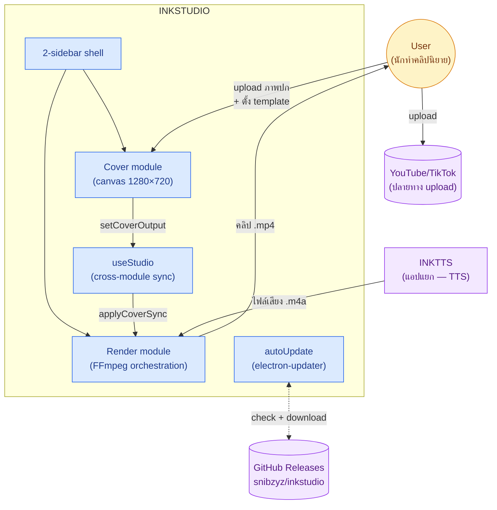
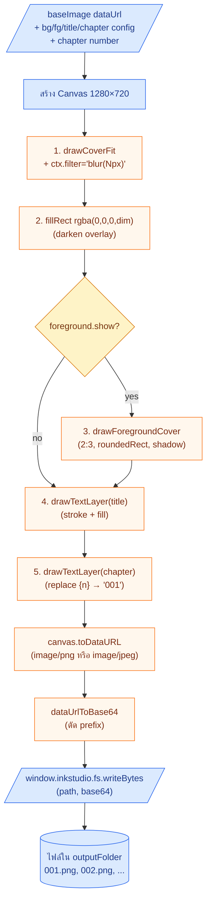
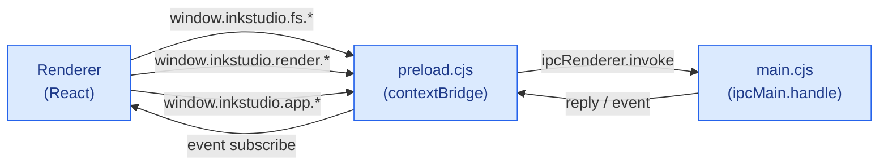
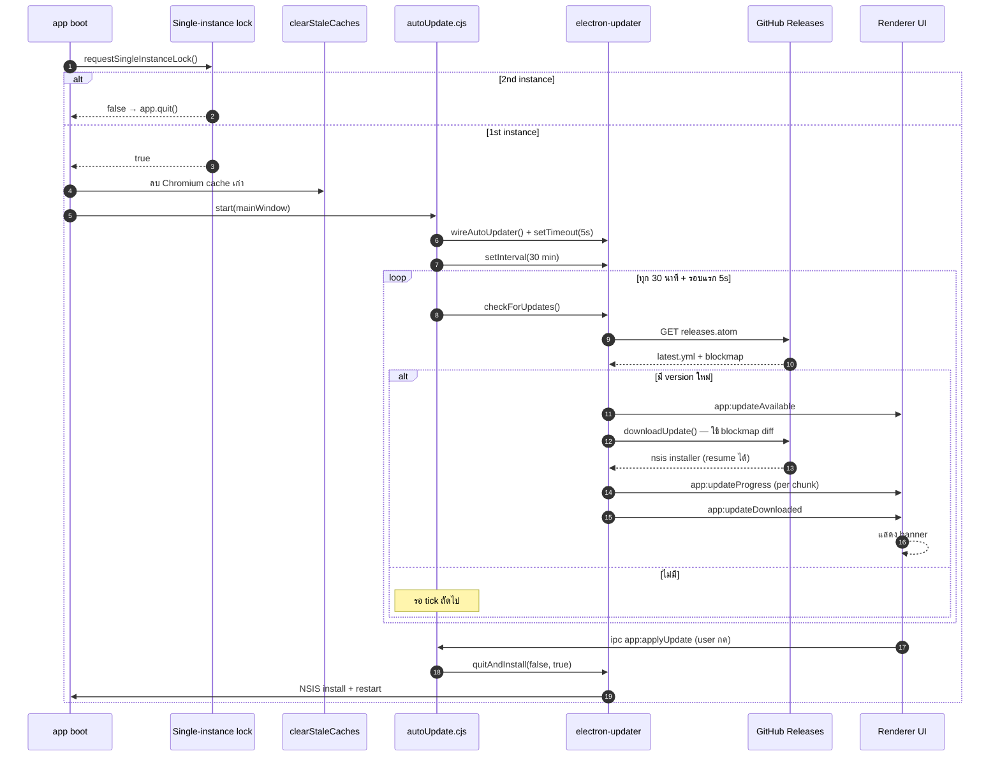

# INKSTUDIO — Architecture

> Technical reference สำหรับนักพัฒนา · เสริม [`.claude/CLAUDE.md`](../../.claude/CLAUDE.md)

## 1. Overview

INKSTUDIO เป็น Electron desktop app ที่ทำ 2 งานต่อเนื่อง:

1. **Cover making** — generate ปก video frame (1280×720) ทุกตอนแบบ batch จากภาพต้นแบบ 1 ภาพ
2. **Video render** — เรนเดอร์คลิป mp4 จาก (ปก + ไฟล์เสียง) คู่กัน ผ่าน FFmpeg

INKTTS (app แยก) ผลิตไฟล์เสียง .m4a → INKSTUDIO เอาทั้งโฟลเดอร์เสียงนั้นมาคู่กับปกที่สร้างเอง → ได้คลิป .mp4 พร้อม upload

### System context (C4-style)



## 2. Tech stack

| Layer | Library |
|---|---|
| Runtime | Electron 32 (Chromium 130 + Node 20) |
| Renderer | React 18 + TypeScript 5 + Vite 5 |
| Styling | Tailwind 3 + tokens จาก `.shared/tailwind/tokens.cjs` |
| State | Zustand 4 |
| UI primitives | `.shared/ui/` (AppButton, AppCard, MacPanel, Codicon, ...) — 8 ตัว |
| Canvas | HTML5 Canvas2D ตรง ๆ (ไม่มี fabric.js / konva) |
| IPC | Electron `contextBridge` → namespace `window.inkstudio.*` |
| Auto-update | `electron-updater` + GitHub Releases |
| Packaging | electron-builder (NSIS สำหรับ Windows, DMG สำหรับ Mac) |
| Testing | Vitest (pure-function tests) |

## 3. Directory layout

```
INKSTUDIO/
├── .app/
│   ├── docs/                        ← เอกสารสำหรับนักพัฒนา (ไฟล์นี้)
│   └── shell/                       ← workspace pnpm package
│       ├── electron/                ← main process (CommonJS .cjs)
│       │   ├── main.cjs             ← BrowserWindow + IPC wiring
│       │   ├── preload.cjs          ← contextBridge → window.inkstudio
│       │   ├── autoUpdate.cjs       ← electron-updater orchestrator
│       │   ├── ipc/                 ← window/fs/clipboard/dialog/settings/log/shell
│       │   └── helpers/             ← logger/paths
│       ├── src/                     ← React renderer
│       │   ├── App.tsx              ← 2-sidebar shell
│       │   ├── main.tsx, index.css
│       │   ├── shell/               ← Sidebar / TitleBar / StatusBar
│       │   ├── state/
│       │   │   ├── useApp.ts        ← activeModule (ปก | คลิป)
│       │   │   └── useStudio.ts     ← cover→render sync
│       │   ├── features/
│       │   │   ├── shared/          ← ModuleShell + PortStatusNotice
│       │   │   ├── cover/           ← ★ working
│       │   │   │   ├── index.tsx
│       │   │   │   ├── useCoverState.ts
│       │   │   │   ├── coverRender.ts
│       │   │   │   ├── CoverCanvas.tsx
│       │   │   │   ├── batchExport.ts
│       │   │   │   └── __tests__/coverRender.test.ts
│       │   │   └── render/          ← UI placeholder · FFmpeg port pending
│       │   │       ├── index.tsx
│       │   │       └── README.md
│       │   ├── types/window.d.ts    ← preload bridge types
│       │   └── ui/                  ← 8 primitives copy จาก .shared/ui/
│       ├── public/                  ← logo.ico, logo.png
│       ├── package.json
│       ├── vite.config.ts (port 5573)
│       ├── tailwind.config.js
│       └── tsconfig.json
├── .claude/CLAUDE.md
├── package.json (workspace root)
├── pnpm-workspace.yaml
├── start.bat / install.bat
└── README.md
```

## 4. Cover render pipeline



### Pure functions (testable in Node)

`coverRender.ts` exports:
- `formatChapterNumber(n, padding) → string` — `padStart('0')`
- `resolveChapterText(template, n, padding) → string` — replace `{n}` token
- `drawCover(ctx, opts) → void` — full draw pipeline (ต้องการ Canvas2D context)
- `dataUrlToBase64(dataUrl) → string` — ตัด prefix

`__tests__/coverRender.test.ts` — vitest unit tests สำหรับ 2 pure functions แรก (8 cases, ผ่านหมด)

### Batch loop

`batchExport.ts` — `runBatchExport(input, onProgress, shouldCancel)`:

1. validate config (outputFolder, end ≥ start, step ≥ 1)
2. load HTMLImageElement จาก dataUrl
3. สร้าง offscreen `<canvas>` ขนาด 1280×720
4. loop `start..end` step `step`:
   - `drawCover(ctx, { ...input, chapterNumber: n })`
   - `canvas.toDataURL(mime, quality)`
   - `dataUrlToBase64`
   - `window.inkstudio.fs.writeBytes(joinPath(outputFolder, fileName), base64)`
   - `onProgress(...)` + `await tick()` ให้ UI render ระหว่างทำงาน
   - check `shouldCancel()` ทุก iteration
5. return `{ totalFiles, successCount, failedFiles }`

## 5. State management

| Store | Scope | Persist |
|---|---|---|
| `useApp` | activeModule (ปก/คลิป) | localStorage `inkstudio:app:v1` |
| `useStudio` | cross-module sync (cover output → render input) | localStorage `inkstudio:studio:v1` |
| `useCoverState` | cover module: baseImage, bg, fg, title, chapter, batch, scripts, job | localStorage `inkstudio:cover:v2` + `inkstudio:cover-scripts:v2` |

`baseImage` (dataUrl) **ไม่** persist — ต้องอัปโหลดใหม่ทุกครั้งเปิดแอป (กันบวมใน localStorage)

## 6. IPC surface



ทุก channel ที่ใช้ตอนนี้ — exposed ใน `electron/preload.cjs` ที่ `window.inkstudio.*`:

| Namespace | Method | Used by |
|---|---|---|
| `fs` | `chooseFile({ filters })` | ImageSection (เลือกภาพปก) |
| `fs` | `chooseFolder()` | ExportSection (เลือกโฟลเดอร์ปลายทาง) |
| `fs` | `readBytes(path) → { ok, base64 }` | ImageSection (โหลดภาพต้นแบบ) |
| `fs` | `writeBytes(path, base64) → { ok }` | batchExport (เขียนปกทุกตอน) |
| `fs` | `revealFolder(path)` | ExportSection (เปิดใน Explorer) |
| `app` | `version` (sync), `checkUpdate`, `applyUpdate` | autoUpdate banner (TODO: UI ยังไม่มี) |
| `app` | events: `updateAvailable/Progress/Downloaded/Error` | (TODO) |

ที่ยังไม่ wire (port from INKIDEA `electron/ipc/render.cjs`):

| Channel | Purpose |
|---|---|
| `render:start-batch-cover` | start FFmpeg job |
| `render:cancel-job` | cancel |
| `render:progress` event | progress payload |
| `render:get-preferred-encoder` | suggest encoder ตาม GPU |
| `preset:list/save/delete` | render preset store |
| `fs:list-audio-files` | list audio files in folder |

## 7. Auto-update flow (NSIS + electron-updater)



**Concurrency / cache safety**:

| ปัญหา | กันยังไง |
|---|---|
| User เปิดแอป 2 ครั้ง | `app.requestSingleInstanceLock()` → instance #2 quit ทันที |
| Chromium cache เสีย | `clearStaleCaches()` ลบ 6 cache dirs ทุกครั้งบูต |
| HTTP cache | `--disable-http-cache` switch |
| GPU shader cache | `--disable-gpu-shader-disk-cache` switch |
| 2 instances ดาวน์โหลด update พร้อมกัน | เป็นไปไม่ได้ — single-instance lock กันก่อน |
| Update download incomplete | electron-updater resume + hash verify (built-in) |
| User ไม่กด apply | `autoInstallOnAppQuit=true` — install ตอน quit ปกติ |

### Artifacts ที่ build ออกมา

```
release/
├── INKSTUDIO-Setup-0.1.0.exe        ← NSIS installer (82 MB)
├── INKSTUDIO-Setup-0.1.0.exe.blockmap  ← differential update diff
├── latest.yml                       ← electron-updater metadata
└── win-unpacked/                    ← raw unpacked app
```

upload `*.exe`, `*.blockmap`, `latest.yml` ไป GitHub Release — electron-updater จะอ่าน `latest.yml` ตอน checkForUpdates

## 8. Build / verify commands

```bash
# Dev
pnpm dev                 # vite (5573) + electron

# Verify (รันใน CI ทุก commit ที่แตะ src/)
pnpm typecheck           # tsc --noEmit
pnpm test                # vitest run (pure-function tests)
pnpm build               # vite build → dist/

# Package
pnpm package:win         # NSIS installer ใน release/
pnpm package:mac         # DMG ใน release/

# Publish (ต้อง GH_TOKEN ใน env)
pnpm publish:win         # NSIS + publish to GitHub Releases
pnpm publish:mac         # DMG + publish
```

## 9. Render port roadmap

**Phase A — Renderer-side (เสร็จ ✓)**
- Fork ไฟล์ render module 12 ตัวจาก INKIDEA workspace/render
- เปลี่ยน IPC namespace: `window.electron.ipc.*` → `window.inkstudio.render.*` ผ่าน `electronIpcShim`
- ลบ machine preset / encoding section / preset save-load — fix profile เป็น 144p · 1 fps · CRF 51 · Software H.264 · ultrafast
- เพิ่ม `introClipPath` state + UI picker ใน RenderSourceSection — persist ลง localStorage
- เปลี่ยน sections 7 → 4 (Overview / Source / Files / Render) + QuickActions

**Phase B — Main-side FFmpeg + IPC (TODO)**

implement handlers ใน `electron/ipc/render.cjs`:

```js
// render:startBatch
// receives: { jobId, coverPath|coverFolder, useMultipleCovers, audioFolder,
//             selectedAudioFiles, outputFolder, titlePrefix, introClipPath?,
//             encodeOption, crfValue, resolutionLabel, fps, preset, overwriteMode }

for (const audioName of selectedAudioFiles) {
  const cover = resolveCover(audioName)  // single หรือ match name ใน coverFolder
  const out = path.join(outputFolder, `${titlePrefix}${baseName(audioName)}.mp4`)
  const args = [
    '-y',
    // ── intro (เสริม) ──
    ...(introClipPath ? ['-i', introClipPath] : []),
    // ── ภาพปก static ──
    '-loop', '1', '-framerate', String(fps),  // fps = 1
    '-i', cover,
    // ── เสียง ──
    '-i', path.join(audioFolder, audioName),
    // ── filter: concat intro+ปก ถ้ามี intro ──
    ...(introClipPath ? [
      '-filter_complex',
      '[0:v]scale=256:144,setsar=1,fps=1[v0];' +
      '[1:v]scale=256:144,setsar=1,fps=1[v1];' +
      '[v0][0:a][v1][2:a]concat=n=2:v=1:a=1[v][a]',
      '-map', '[v]', '-map', '[a]',
    ] : [
      '-vf', 'scale=256:144,setsar=1',
      '-map', '0:v:0', '-map', '1:a:0',  // หรือ 0:v / 1:a ตาม index
    ]),
    // ── encode: libx264 ultrafast CRF 51 (เร็วสุด ไฟล์เล็กสุด) ──
    '-c:v', 'libx264', '-preset', 'ultrafast', '-crf', String(crfValue),  // 51
    '-pix_fmt', 'yuv420p', '-r', String(fps),  // 1 fps
    '-c:a', 'aac', '-b:a', '96k', '-ar', '44100',
    '-shortest', '-movflags', '+faststart',
    out,
  ]
  const proc = spawn(ffmpegPath, args)
  proc.stderr.on('data', (chunk) => {
    // parse "frame=N fps=N time=HH:MM:SS.ms bitrate=N kbps"
    // emit render:progress to renderer
  })
  // proc.kill('SIGKILL') ตอน render:cancelJob
}
```

**Phase C — Verify**
- smoke test: 1 cover + 1 short audio file → mp4 ที่ play ได้
- verify ขนาดไฟล์ < 50 KB ต่อนาทีเสียง (เพราะ video stream ที่ 1 fps + CRF 51 เล็กมาก)
- progress event ถ่ายทอดถูก (ดู `useRenderJob.ts` payload shape)
- intro clip concat: verify timing สอดคล้อง + frame rate consistent

## 10. Conventions (inherited จาก workspace root CLAUDE.md)

- VS Code Dark+ + amber brand `#F59E0B` (token `vscode-brand`)
- ห้าม hardcode hex — ใช้ `vscode-*` tokens เสมอ
- Codicon เท่านั้น (ห้าม emoji ใน source UI)
- input/button h-8, text-[12px]/[13px], rounded-sm
- 4px/8px spacing grid
- ฟอนต์ Tahoma + Segoe UI + system-ui (Thai-friendly)
