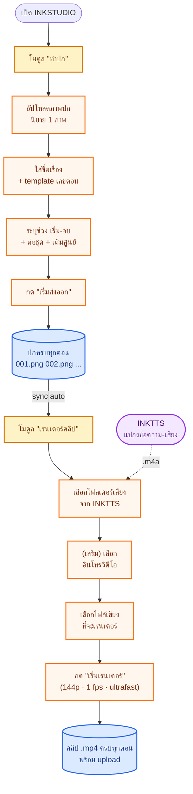
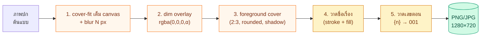
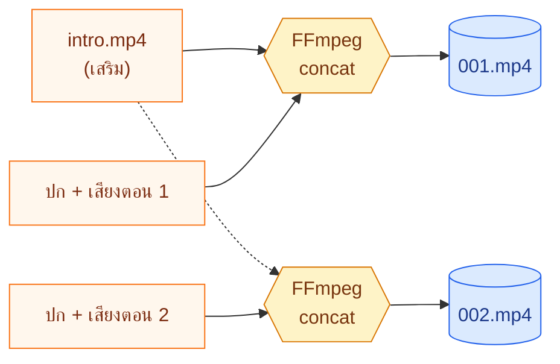
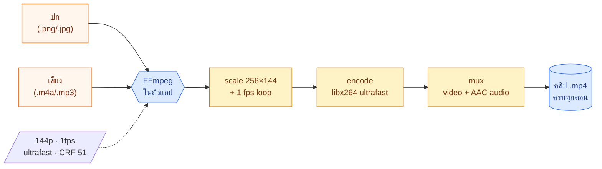
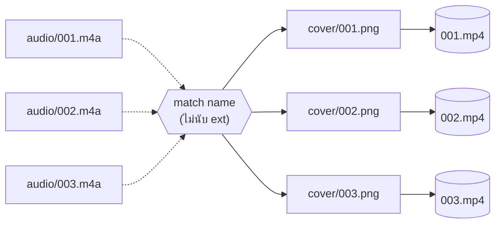

# INKSTUDIO

โปรแกรมสร้าง **ปกตอน + คลิปอ่านนิยาย** ของช่อง YouTube/TikTok นิยาย — ทำงานคู่กับ INKTTS (ที่ผลิตไฟล์เสียง)

อัปโหลดภาพปก 1 ภาพ → ตั้ง template ชื่อเรื่อง + เลขตอน → กดเริ่ม → ได้ปก 1280×720 ครบทุกตอน → เลือกเสียงจาก INKTTS → กดเรนเดอร์ → ได้คลิป .mp4 พร้อม upload

---

## สารบัญ

1. [เริ่มต้นใช้งาน](#เริ่มต้นใช้งาน)
2. [โฟลเดอร์ต่าง ๆ — วางไฟล์อะไรที่ไหน](#โฟลเดอร์ต่าง-ๆ--วางไฟล์อะไรที่ไหน)
3. [ขั้นตอนภาพรวม](#ขั้นตอนภาพรวม)
4. [โมดูล "ทำปก"](#โมดูล-ทำปก)
5. [Photoshop shortcuts บนแคนวาส](#photoshop-shortcuts-บนแคนวาส)
6. [โมดูล "เรนเดอร์คลิป"](#โมดูล-เรนเดอร์คลิป)
7. [Auto-numbering — token `{n}`](#auto-numbering--token-n)
8. [Sync ปก → คลิป](#sync-ปก--คลิป)
9. [Script ของโมดูลทำปก](#script-ของโมดูลทำปก)
10. [อัปเดตอัตโนมัติ](#อัปเดตอัตโนมัติ)
11. [คุณสมบัติ standalone](#คุณสมบัติ-standalone)
12. [แก้ปัญหาที่พบบ่อย](#แก้ปัญหาที่พบบ่อย)
13. [สำหรับนักพัฒนา](#สำหรับนักพัฒนา)

---

## เริ่มต้นใช้งาน

### บนเครื่อง Windows

| ไฟล์ที่โหลด | เหมาะกับ |
|---|---|
| **`INKSTUDIO-Setup-x.x.x.exe`** | ติดตั้งแบบปกติ (มี shortcut + auto-update) |
| **`INKSTUDIO-Portable-x.x.x.exe`** | ไม่ต้องติดตั้ง วางที่ไหนก็ได้ ไฟล์เดียวจบ |

1. ดาวน์โหลดจาก [หน้าดาวน์โหลด](https://github.com/snibzyz/inkstudio/releases/latest)
2. ดับเบิลคลิก
3. ถ้ามีแถบเตือนของ Windows → **More info** → **Run anyway**

### บนเครื่อง Mac

1. ดาวน์โหลด `INKSTUDIO-x.x.x.dmg`
2. **ครั้งแรก**: คลิกขวาที่ไอคอน → **Open** → **Open** อีกครั้ง (อย่าดับเบิลคลิก)
3. ครั้งต่อไปเปิดได้ปกติ

> ไม่ต้องลง FFmpeg, Python, Node — มีให้ครบในไฟล์เดียว

---

## โฟลเดอร์ต่าง ๆ — วางไฟล์อะไรที่ไหน

INKSTUDIO ไม่บังคับโครงสร้างโฟลเดอร์ — เลือกที่ไหนก็ได้ผ่าน dialog

### ที่ "คุณ" เตรียมไว้

| สิ่งที่ต้องเตรียม | วางที่ไหน |
|---|---|
| **ภาพปกต้นแบบ** (.png / .jpg / .webp) | ที่ไหนก็ได้ — เลือกผ่าน dialog ในโมดูล "ทำปก" |
| **ไฟล์เสียง** (.m4a / .mp3 / .wav จาก INKTTS) | โฟลเดอร์ใดก็ได้ — เลือกผ่าน dialog ในโมดูล "คลิป" |

### ที่ "ระบบ" สร้างให้

| โฟลเดอร์ | ระบบใส่อะไรให้ |
|---|---|
| **โฟลเดอร์ปกที่คุณเลือก** | ปก batch ทุกตอน เช่น `001.png`, `002.png`, ... |
| **โฟลเดอร์คลิปที่คุณเลือก** | คลิป .mp4 ทุกตอน เช่น `001.mp4`, `002.mp4`, ... |

### Script + presets เก็บที่ไหน

- **Cover script** (template ของปก) — เก็บใน localStorage ของแอป
- **Render preset** (config การเรนเดอร์) — เก็บใน localStorage
- **Log file** — `%APPDATA%\@inkstudio\desktop-shell\inkstudio.log` (Windows)

---

## ขั้นตอนภาพรวม



> สีส้ม = ขั้นตอนที่คุณทำ · สีเหลือง = โมดูลในแอป · สีฟ้า = ผลลัพธ์ · สีม่วง = แอปอื่น (INKTTS)

---

## โมดูล "ทำปก"

แท็บแรกใน sidebar ซ้าย — สร้างปก batch ที่ canvas 1280×720 (frame ของวิดีโอ 16:9) จากภาพปกนิยาย 1 ภาพ

### ขั้นตอน (5 sections ใน sidebar ของโมดูล)

| ขั้น | section | ทำอะไร |
|:---:|---|---|
| 1 | **ภาพปก** | อัปโหลด `.png` / `.jpg` / `.webp` 1 ไฟล์ |
| 2 | **พื้นหลัง · ปก** | ปรับ blur ของ bg + ขนาด/ตำแหน่งของปก foreground (2:3) + มุมโค้ง + เงา |
| 3 | **ชื่อเรื่อง** | ข้อความคงที่ — ตำแหน่ง · สี · ขนาด · weight |
| 4 | **เลขตอน (auto)** | template `{n}` เช่น `ตอนที่ {n}` — token ถูก replace ตอน render |
| 5 | **ส่งออก batch** | เริ่ม · จบ · ต่อชุด · เติมศูนย์ · format (png/jpg) · ปลายทาง · เริ่มส่งออก |

มี section **สคริปต์** เพิ่ม เพื่อบันทึก/โหลด preset ทั้งชุด

### Pipeline ของการ render 1 ตอน



> Preview canvas ทางขวาของหน้าจอ render ทันทีทุกครั้งที่เปลี่ยน config — มี slider เลื่อนเลขตอนเพื่อดูตัวอย่างหลายตอน

---

## Photoshop shortcuts บนแคนวาส

แคนวาสของโมดูล "ทำปก" ใช้ Fabric.js + viewport แบบ Photoshop — คนคุ้น Photoshop เข้ามาทำงานได้เลย

### มุมมอง (Pan / Zoom)

| ทำอะไร | ปุ่ม |
|---|---|
| Pan ชั่วคราว | `Space` + ลากเมาส์ |
| Pan แบบไม่กดค้าง | คลิกค้างปุ่มกลางเมาส์ (MMB) แล้วลาก |
| Hand tool ค้างถาวร | กด `H` (กด `V` หรือ `Esc` เพื่อออก) |
| Zoom ที่ตำแหน่งเมาส์ | `Ctrl` + scroll |
| Zoom in / out 10% | `Ctrl` + `=` / `Ctrl` + `-` |
| **Fit on Screen** | `Ctrl + 0` |
| **Actual Pixels (100%)** | `Ctrl + 1` |

> Cursor เปลี่ยนตามโหมด: มือเปิด `grab` ตอน Space, มือกำ `grabbing` ตอนลาก, แว่นขยาย `zoom-in/out` ตอน Ctrl+scroll, `copy` ตอนกด Alt ค้าง

### ประวัติ + Transform

| ทำอะไร | ปุ่ม |
|---|---|
| Undo | `Ctrl + Z` |
| Redo | `Ctrl + Shift + Z` หรือ `Ctrl + Y` |
| Free Transform | `Ctrl + T` |

### Selection

| ทำอะไร | ปุ่ม |
|---|---|
| ยกเลิกเลือก | `Esc` หรือ `Ctrl + D` |
| เลือกทั้งหมด (ยกเว้นพื้นหลัง) | `Ctrl + A` |

### Layer

| ทำอะไร | ปุ่ม |
|---|---|
| ลบเลเยอร์ที่เลือก | `Delete` / `Backspace` |
| ทำสำเนา | `Ctrl + J` |
| **Alt + ลาก** | ทำสำเนาตอนลาก (ของเดิมอยู่ที่เดิม) |
| ขึ้นหน้า / ลงหลัง | `Ctrl + ]` / `Ctrl + [` |
| บนสุด / ล่างสุด | `Ctrl + Shift + ]` / `Ctrl + Shift + [` |

### Nudge (ขยับทีละ pixel)

| ทำอะไร | ปุ่ม |
|---|---|
| ขยับ 1 px | `↑` `↓` `←` `→` |
| ขยับ 10 px | `Shift + ↑` ฯลฯ |

---

## โมดูล "เรนเดอร์คลิป"

แท็บที่สองใน sidebar — combine ปก + ไฟล์เสียง → .mp4 ผ่าน FFmpeg (bundle มาในแอป)

### โปรไฟล์ฟิกซ์ — เร็วสุด ทรัพยากรน้อยสุด

INKSTUDIO **ไม่ให้เลือก resolution / encoder / CRF** — ฟิกซ์ที่ค่าเดียวเพื่อให้ทำงานเร็วสุด ทรัพยากร CPU น้อยสุด ไฟล์เล็กสุด

| ค่า | สเปก | เหตุผล |
|---|---|---|
| **Resolution** | `144p` (256×144) | ภาพนิ่งจริง ๆ — YouTube จะ re-encode ทุก resolution ตอน upload อยู่แล้ว |
| **Framerate** | `1 fps` | ไม่มีการเคลื่อนไหว — 1 fps เพียงพอ + video stream เล็กกว่ามาก |
| **Codec** | `libx264` (Software H.264) | ไม่ต้องพึ่ง GPU — ทำงานได้ทุกเครื่อง |
| **CRF** | `51` (แย่สุดที่ x264 รองรับ) | เป็นภาพนิ่ง compression อัตราสูงไม่เห็นความต่าง |
| **Preset** | `ultrafast` | speed สูงสุดของ x264 — CPU ทำงานน้อยสุด |
| **Audio** | `AAC 96 kbps · 44.1 kHz` | bitrate ต่ำ ฟังตามปกติ |

### ขั้นตอน (4 sections ใน sidebar ของโมดูล)

| ขั้น | section | ทำอะไร |
|:---:|---|---|
| — | **ภาพรวม** | แสดงสถานะ FFmpeg + คิวงาน + ETA |
| 1 | **แหล่งข้อมูล** | ปกเดียวหรือโฟลเดอร์ปก · โฟลเดอร์ไฟล์เสียง · **อินโทร (เสริม)** · ปลายทาง · คำนำหน้า |
| 2 | **ไฟล์เสียง** | เลือกไฟล์เสียงทีละไฟล์หรือทั้งหมด · search filter |
| 3 | **เรนเดอร์** | เริ่ม · ดู progress real-time · ยกเลิก |

### แทรกอินโทร (intro clip — ไม่บังคับ)

ใน section "แหล่งข้อมูล" → field **"แทรกอินโทร (ไม่บังคับ)"** — เลือกไฟล์ `.mp4` / `.mov` / `.mkv` / `.webm` / `.avi`



> อินโทรจะถูก prepend หน้าทุกตอน — เผื่อใช้เป็นโลโก้ช่อง / sponsor / สวัสดีผู้ฟัง / โฆษณาสั้น

### Pipeline ของการ render 1 คลิป



### Multi-cover mode

ถ้าใช้ **โฟลเดอร์ปก (ไม่ใช่ปกเดียว)** — INKSTUDIO จะ match audio file กับ cover file ตามชื่อ (ไม่นับ extension, case-insensitive)



ถ้าหาปกที่ match ไม่เจอ → ข้ามตอนนั้น + แสดงในรายการ "missingCovers"

---

## Auto-numbering — token `{n}`

ใส่ `{n}` ในข้อความของ "เลขตอน" → จะถูก replace ด้วยเลขตอนที่ pad ด้วยศูนย์ตาม padding setting

| Template | Start | End | Padding | ตัวอย่างผลลัพธ์ |
|---|:---:|:---:|:---:|---|
| `ตอนที่ {n}` | 1 | 100 | 3 | `ตอนที่ 001`, `ตอนที่ 002`, ..., `ตอนที่ 100` |
| `EP {n}` | 1 | 50 | 2 | `EP 01`, `EP 02`, ..., `EP 50` |
| `บทที่ {n} ภาคพิเศษ` | 1 | 12 | 2 | `บทที่ 01 ภาคพิเศษ`, ..., `บทที่ 12 ภาคพิเศษ` |

รองรับ `{n}` หลายตำแหน่งใน template เดียวด้วย (replace ทุกตำแหน่ง)

---

## Sync ปก → คลิป

หลังกด "เริ่มส่งออก" ในโมดูลทำปก → ระบบบันทึก path ของโฟลเดอร์ปลายทางไว้

เมื่อเปิดโมดูล "คลิป" → section "แหล่งข้อมูล" แสดง card สีส้ม:

```mermaid
sequenceDiagram
    participant U as User
    participant C as โมดูล &quot;ทำปก&quot;
    participant S as useStudio (state กลาง)
    participant R as โมดูล &quot;คลิป&quot;

    U->>C: กด &quot;เริ่มส่งออก&quot;
    C->>C: render ปก batch ทุกตอน
    C->>S: setCoverOutput(folder + updatedAt)
    U->>R: เปิดโมดูลคลิป
    R->>S: get coverOutput
    S->>R: { folder, updatedAt }
    R-->>U: แสดง card &quot;ใช้ปกล่าสุด&quot;
    U->>R: กด &quot;ใช้ปกล่าสุด&quot;
    R->>R: setCoverFolder(folder)
```

---

## Script ของโมดูลทำปก

INKSTUDIO มี **Cover script** อย่างเดียว — โมดูลเรนเดอร์คลิปไม่มี preset เพราะค่าทุกอย่างฟิกซ์ (ดู "โปรไฟล์ฟิกซ์" ของโมดูลเรนเดอร์)

### Cover script

เก็บ: pixel ของ blur · dim · foreground cover (ขนาด/ตำแหน่ง/มุมโค้ง/เงา) · title text layer · chapter template · batch range · padding · format

ใช้ซ้ำกับนิยายเรื่องอื่น — แค่อัปโหลดภาพใหม่ + load script

เก็บใน localStorage ของแอป — Reset ผ่าน DevTools (`F12` → Application → Local Storage → ลบ key `inkstudio:*`)

> **อินโทร** ที่เลือกล่าสุดถูกจำไว้ใน localStorage โดยอัตโนมัติด้วย — เปิดแอปครั้งต่อไปไม่ต้องเลือกใหม่

---

## อัปเดตอัตโนมัติ

INKSTUDIO ใช้ **NSIS installer + electron-updater** (Windows) / DMG + electron-updater (Mac)

```mermaid
sequenceDiagram
    participant A as INKSTUDIO
    participant G as GitHub Releases
    participant U as User

    A->>A: boot — ตรวจ single-instance lock ก่อน
    A->>A: clearStaleCaches() — ล้าง Chromium cache
    A->>G: check release (ทุก 30 นาที + รอบแรกหลัง 5 วิ)
    G-->>A: latest.yml + blockmap
    alt มี version ใหม่
        A->>G: download installer (diff via blockmap)
        G-->>A: ดาวน์โหลดเสร็จ
        A-->>U: แสดง banner &quot;รีสตาร์ทเพื่ออัพเดต&quot;
        U->>A: กดปุ่ม
        A->>A: quitAndInstall() — NSIS install ใหม่ + restart
    else ไม่มี version ใหม่
        A->>A: รอ 30 นาที check ใหม่
    end
```

### กันปัญหา cache เมื่อมีการเปิดหลาย instance

| ปัญหา | วิธีกัน |
|---|---|
| User เปิดแอป 2 ครั้ง พร้อมกัน | **Single-instance lock** — instance ที่ 2 quit ทันที + ส่ง signal ให้ตัวแรก focus |
| Chromium cache เสียทำให้ค้าง | **clearStaleCaches()** ลบ `Cache/`, `Code Cache/`, `GPUCache/`, `Shader Cache/` ทุกครั้งบูต |
| Disk cache ของ HTTP | **disable-http-cache** + **disable-gpu-shader-disk-cache** command-line switch |
| Update folder corrupt | electron-updater จัดการ resume + hash verify เอง — เราไม่แตะ |
| ดาวน์โหลด update ซ้ำหลาย instance | ไม่มี — เพราะ single-instance lock เพียง 1 process เท่านั้นที่ตรวจ + ดาวน์โหลด |

---

## คุณสมบัติ standalone

> User ไม่ต้องลงโปรแกรมเสริมใด ๆ

| ตัวที่ bundle มา | เวอร์ชัน | ใช้ทำอะไร |
|---|---|---|
| **Electron** | 32 | runtime + Chromium 130 |
| **FFmpeg** (ffmpeg-static) | 6.1.1 | render mp4 จากปก + เสียง |
| **electron-updater** | 6.3.9 | NSIS / DMG auto-update via GitHub Releases |

FFmpeg bundle มีในตัว config NVENC + libx264 + libx265 + AAC ครบ — อ่าน [.app/docs/architecture.md](./.app/docs/architecture.md) สำหรับรายละเอียดทาง technical

---

## แก้ปัญหาที่พบบ่อย

### แอปเปิดไม่ขึ้น / ต้องผ่าน Windows SmartScreen

INKSTUDIO **ยังไม่ได้ลงนาม code signing** — Windows จะเตือนว่า "Windows protected your PC"

แก้: กด **More info** → **Run anyway**

### Preview canvas ขึ้นเป็น amber gradient

= ยังไม่ได้อัปโหลดภาพปก ไปที่ section **ภาพปก** แล้วเลือกไฟล์

### "FFmpeg ไม่พร้อม"

ดูใน section **ภาพรวม** ของโมดูลคลิป — ถ้าเขียนว่า "ไม่พร้อม" ให้:
1. ดาวน์โหลด INKSTUDIO ใหม่ (รุ่นล่าสุด)
2. ถ้ารัน dev mode — รัน `pnpm install` ใหม่

### เปิดแอปแล้วไม่ขึ้น (เคยมี window มาก่อน)

ระบบมี **single-instance lock** — ถ้ามี instance ก่อนหน้าค้างใน task manager ให้ kill ก่อน

### Auto-update ไม่ทำงาน

- **dev mode** — ตั้งใจ skip (`NODE_ENV === 'development'`)
- **packaged** — ตรวจว่าเปิดเชื่อมเน็ตได้ + ดู log ที่ `%APPDATA%\@inkstudio\desktop-shell\inkstudio.log`
- ถ้า log บอก 404 — repo ยังไม่มี release นั้น

### Reset settings

ลบ localStorage ของแอป — กด `F12` → Application → Local Storage → ลบ key ที่ขึ้นต้นด้วย `inkstudio:`

---

## สำหรับนักพัฒนา

```bash
cd "INKSTUDIO/"
pnpm install            # หรือดับเบิลคลิก install.bat
pnpm dev                # หรือดับเบิลคลิก start.bat
```

Dev server รันที่ port **5573** + Electron จะเปิดอัตโนมัติ

### Verification commands

```bash
pnpm typecheck          # ตรวจ TS — 0 errors
pnpm test               # vitest run — 106 tests pass (coverEditorUtils, useRender, shims, ...)
pnpm build              # vite build → dist/ (~640 KB JS, 77 KB CSS, ~1700 modules)

# Package (NSIS + Portable)
pnpm package:win        # → release/INKSTUDIO-Setup-x.x.x.exe (≈106 MB)
                        #   release/INKSTUDIO-Portable-x.x.x.exe (≈106 MB)
pnpm package:mac        # DMG

# Publish (ต้อง GH_TOKEN env var)
pnpm publish:win        # + publish ไป GitHub Releases (snibzyz/inkstudio)
```

### โครงสร้าง

```
INKSTUDIO/
├── .app/
│   ├── docs/architecture.md         ← technical reference
│   └── shell/                       ← pnpm workspace package (@inkstudio/desktop-shell)
│       ├── electron/                ← main process
│       │   ├── main.cjs             ← single-instance + cache hardening
│       │   ├── preload.cjs          ← contextBridge → window.inkstudio
│       │   ├── autoUpdate.cjs       ← electron-updater (NSIS / DMG)
│       │   ├── ipc/render.cjs       ← FFmpeg orchestration (TODO — main process)
│       │   ├── ipc/renderHelpers.cjs ← pure helpers (testable)
│       │   ├── helpers/ffmpeg.cjs   ← path resolve (asar unpack handling)
│       │   └── __tests__/           ← node test runner
│       └── src/                     ← React renderer
│           ├── App.tsx              ← 2-sidebar shell
│           ├── shell/               ← Sidebar / StatusBar
│           ├── state/
│           │   ├── useApp.ts        ← activeModule
│           │   ├── useStudio.ts     ← cover→render sync
│           │   ├── useHubWorkspace.ts ← INKIDEA shim (mock workspace)
│           │   └── electronIpcShim.ts ← window.electron.ipc.* → window.inkstudio.*
│           ├── features/
│           │   ├── cover/           ← Fabric.js canvas (fork จาก INKIDEA)
│           │   │   ├── setupCoverCanvas.ts    ← viewport + pan + cursor + Alt-drag
│           │   │   ├── CoverEditor.tsx        ← root + tabs
│           │   │   ├── CoverCanvas.tsx        ← toolbar + pasteboard
│           │   │   ├── CoverInspectorPanel.tsx + inspector/  ← 8 sections
│           │   │   ├── useCoverEditor.ts      ← shortcuts + layer ops (860 LOC)
│           │   │   └── ... + 9 ไฟล์ helper
│           │   ├── render/          ← Render module (fork จาก INKIDEA, ลดเหลือ profile fix)
│           │   │   ├── RenderTab.tsx
│           │   │   ├── RenderSettingsPane.tsx
│           │   │   ├── sections/{Overview,Source,Files,Progress,QuickActions}
│           │   │   ├── useRender.ts            ← zustand store (introClipPath persist)
│           │   │   ├── useRenderJob.ts         ← IPC orchestration
│           │   │   ├── renderConstants.ts      ← FIXED_RESOLUTION='144p', FIXED_CRF=51, ...
│           │   │   └── renderTypes.ts
│           │   └── shared/          ← ModuleShell (legacy)
│           ├── shared-ui/           ← @shared/ui fork (40 ไฟล์ from INKIDEA)
│           ├── workspace/           ← HubIdeSettingsShell facade
│           └── types/window.d.ts    ← window.inkstudio + LegacyElectronIpc types
├── .claude/CLAUDE.md                ← developer memory
├── package.json (workspace root)
├── pnpm-workspace.yaml
├── start.bat / install.bat
└── README.md (ไฟล์นี้)
```

ดูรายละเอียดทาง technical ที่ [`.app/docs/architecture.md`](./.app/docs/architecture.md) และ memory ของนักพัฒนาที่ [`.claude/CLAUDE.md`](./.claude/CLAUDE.md)

---

## License + ที่มา

- **Cover canvas** fork จาก **INKIDEA** workspace/cover (Fabric.js artboard + zoom/pan + smart guides)
- **Render module** fork จาก **INKIDEA** workspace/render → ลดเหลือโปรไฟล์ฟิกซ์ 144p/1fps + เพิ่ม intro clip
- **UI primitives** (`@shared/ui`) fork จาก **INKIDEA** `.app/shared/ui/` ทั้ง 40 ไฟล์
- **Electron shell** มาจาก **INKTTS** (single-instance lock + cache hardening + electron-updater)
- **Brand amber** `#F59E0B` มาจาก **INKREALM**
- **FFmpeg** ใช้ `ffmpeg-static` (FFmpeg 6.1.1 gyan.dev build) — `-c:v libx264 -preset ultrafast -crf 51 -r 1 -vf scale=256:144`
- **Photoshop UX**: Space/MMB pan, Ctrl+wheel zoom-at-cursor, H/V tool toggle, Alt+drag duplicate, Ctrl+0/1 view, Ctrl+] / Ctrl+[ stack, Delete / Ctrl+J / arrow nudge
